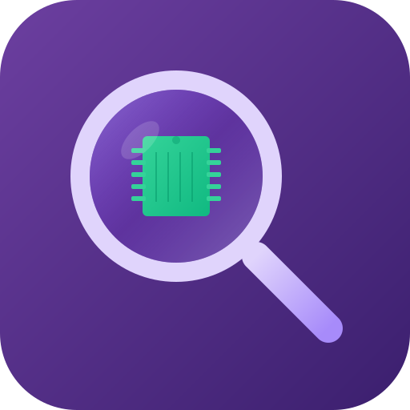

[](https://github.com/sponsors/MarcelRoozekrans)

<p align="center">
  
</p>

<h1 align="center">MemoryLens MCP</h1>

<p align="center">
  <a href="https://www.nuget.org/packages/MemoryLens.Mcp"></a>
  <a href="https://www.nuget.org/packages/MemoryLens.Mcp"></a>
  <a href="https://www.npmjs.com/package/memorylens-mcp"></a>
  <a href="https://github.com/MarcelRoozekrans/memorylens-mcp/actions"></a>
  <a href="https://github.com/MarcelRoozekrans/memorylens-mcp/blob/main/LICENSE"></a>
</p>

<p align="center">
  On-demand .NET memory profiling with concrete, AI-actionable code fix suggestions — no profiler to install.
</p>

<a href="https://glama.ai/mcp/servers/MarcelRoozekrans/memorylens-mcp">
  
</a>

<!-- mcp-name: io.github.MarcelRoozekrans/memorylens-mcp -->

---

## Hosted deployment

A hosted deployment is available on [Fronteir AI](https://fronteir.ai/mcp/marcelroozekrans-memorylens-mcp).

## Quick Start

### npx (any MCP client)

```json
{
  "mcpServers": {
    "memorylens": {
      "type": "stdio",
      "command": "npx",
      "args": ["-y", "memorylens-mcp"]
    }
  }
}
```

The npm package ships no server code — it is a launcher that installs the `MemoryLens.Mcp` .NET
global tool at a matching version and execs it, so the **.NET 10 SDK must be on `PATH`**.
Subsequent starts skip the install entirely and work offline.

### VS Code / Visual Studio (via dnx)

Add to your MCP settings (`.vscode/mcp.json` or VS settings):

```json
{
  "servers": {
    "memorylens": {
      "type": "stdio",
      "command": "dnx",
      "args": ["MemoryLens.Mcp", "--yes"]
    }
  }
}
```

### Claude Code Plugin

```bash
claude install gh:MarcelRoozekrans/memorylens-mcp
```

### .NET Global Tool

```bash
dotnet tool install -g MemoryLens.Mcp
```

### Docker

```bash
docker build -t memorylens-mcp .
docker run -i --rm --pid=host --cap-add=SYS_PTRACE \
  -v "$PWD:/workspace" memorylens-mcp
```

Profiling from a container needs `ptrace` and the host PID namespace, and on
Docker Desktop that namespace is the Linux VM rather than your desktop — see
[docs/docker.md](docs/docker.md) before choosing this route.

## Prerequisites

- [.NET 10 SDK](https://dotnet.microsoft.com/download/dotnet/10.0), 10.0.4xx feature band (pinned in `global.json`)

Running a filtered subset of the tests, e.g. `dotnet test --filter <name>`, will exit with code 9
and print `error: 1, failed: 0`. That's the test project's discovery-collapse guard
(`--minimum-expected-tests`) firing because the filter left fewer tests than expected — it is
not a test failure, and a full `dotnet test` run is unaffected.

## How Collection Works

MemoryLens collects heap data **in-process** over [EventPipe](https://learn.microsoft.com/dotnet/core/diagnostics/eventpipe), the .NET runtime's built-in diagnostics channel. There is no profiler to install, no download on first use, and no external tool on `PATH`.

`snapshot` attaches to a running .NET process by pid, induces a collection, and aggregates the heap into per-type counts and sizes. Snapshots are written as small JSON files under your temp directory and referenced by a short id.

On Linux and in containers, attaching to another process's diagnostic endpoint may require matching UID or `SYS_PTRACE` — see [docs/docker.md](docs/docker.md).

## Available MCP Tools

| Tool | Description |
|------|-------------|
| `list_processes` | Lists running .NET processes available for profiling, discovered from their diagnostic IPC endpoints |
| `snapshot` | Captures a single memory snapshot of a target process |
| `compare_snapshots` | Captures two snapshots with configurable delay and compares them |
| `analyze` | Runs the rule engine against a captured snapshot and returns findings |
| `get_rules` | Lists all available analysis rules with their metadata |

## Built-in Rules

| ID | Severity | Category | Description |
|----|----------|----------|-------------|
| ML001 | critical | leak | Event handler leak detected |
| ML002 | critical | leak | Static collection growing unbounded |
| ML003 | high | leak | Disposable object not disposed |
| ML004 | high | fragmentation | Large Object Heap fragmentation |
| ML005 | medium | retention | Object retained longer than expected |
| ML006 | medium | allocation | Excessive allocations in hot path |
| ML007 | medium | retention | Closure retaining unexpected references |
| ML008 | low | allocation | Array/list resizing without capacity hint |
| ML009 | low | pattern | Finalizer without Dispose pattern |
| ML010 | low | pattern | String interning opportunity |

## Configuration

Create a `.memorylens.json` file in your project root to customize rule behavior:

```json
{
  "rules": {
    "ML001": { "enabled": true, "severity": "critical" },
    "ML002": { "enabled": true, "severity": "critical" },
    "ML003": { "enabled": true, "severity": "high" },
    "ML004": { "enabled": true, "severity": "high" },
    "ML005": { "enabled": true, "severity": "medium" },
    "ML006": { "enabled": true, "severity": "medium" },
    "ML007": { "enabled": true, "severity": "medium" },
    "ML008": { "enabled": true, "severity": "low" },
    "ML009": { "enabled": true, "severity": "low" },
    "ML010": { "enabled": true, "severity": "low" }
  }
}
```

## Usage Examples

### Single Snapshot

Capture a memory snapshot of a running process to inspect current memory state:

```
> /memorylens
> Take a snapshot of my running API (PID 12345)
```

Claude will call `snapshot` with the target PID, then `analyze` the returned snapshot id and present findings ordered by severity.

### Before/After Comparison

Detect memory growth by comparing two snapshots taken with a delay:

```
> /memorylens
> Check if my app has a memory leak — compare before and after processing 1000 requests
```

Claude will call `compare_snapshots` with a `delaySeconds` value (default 10 seconds) between the two captures, then analyze the diff to identify objects that grew between snapshots.

## License

[MIT](LICENSE)